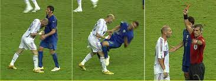

```{r include=FALSE}
library(tidyverse)
data = read.csv("angry_moods.csv") %>% 
          mutate(Sex = ifelse(Sex==2, 0, 1)) %>% 
          mutate(Athlete = ifelse(Athlete==2, 0, 1))
```


## Background  




Sports psychologists have been trying to understand the effect of anger on sports performance for a long time.  

Key question: \newline
do athletes handle anger differently than non-athletes?


## How do psychologists measure anger management?

One way: \newline
questionnaire called STATXI-2 which produces the anger expression (AE) index.

AE:\newline
overall estimate of the person’s tendencies to express anger either outwardly toward other people, or inwardly toward herself


## Components of Anger Expression Index

$$AE = AO + AI - CO - CI +48$$ 

+ Anger-Out (AO):  how much a person expresses their anger in an outwardly negative and poorly controlled manner.
+ Anger-In (AI): the extent to which people hold things in or suppress anger when they are angry or furious.
+ Control-Out (CO): measures how much effort does the person expend to control anger.
+ Control-In (CI): measures how often a person attempts to relax, calm down,.

# Data Description

Survey data provided from Rice University with the questionnaire to gauge AE. \newline
48 females and 30 males, and 25 athletes and 53 non-athletes.


```{r, echo=FALSE}
data %>% head() %>% as.data.frame()
```

Contingency table:

```{r, echo=FALSE}
Sex=data$Sex
Athlete = data$Athlete

table(Sex, Athlete)
```

# Main Research Questions 

+ Do athletes and non-athletes deal with anger in the same way?
+ Are there any gender differences?
+ If there are differences by gender and athlete status, how do they differ? 
+ Are there relationships among AO, AI, CO, CI?

# EDA 

Box plots 

# Two-Way ANOVA 

Seokjun please add content

# Explore Relationships: AO, AI, CO, CI

Pair plots 

# Discussion 

Any questions? Comments? Suggestions? 

